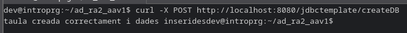
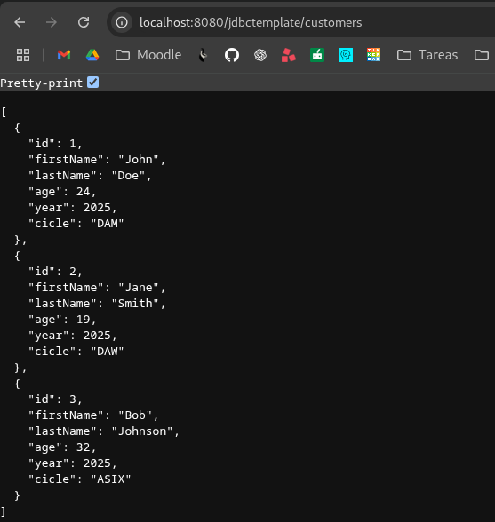

# ad_ra2_aav1

Per a poder fer un post (l'endpoint createDB que crea la taula i insereix les dades) ja que no es pot fer desde el navegador, s'executa la següent comanda per terminal:

La següent captura mostra la pàgina per fer login que s'accedeix desde localhost:8080/h2-console tal i com s'ha indicat al fitxer application.properties.

Un cop es fà login es pot veure amb un SELECT * la taula creada amb 3 clients.

De la mateixa forma es poden veure els clients en format json a l'endpoint customers del controlador que crida la funció findAll() del repositori.
