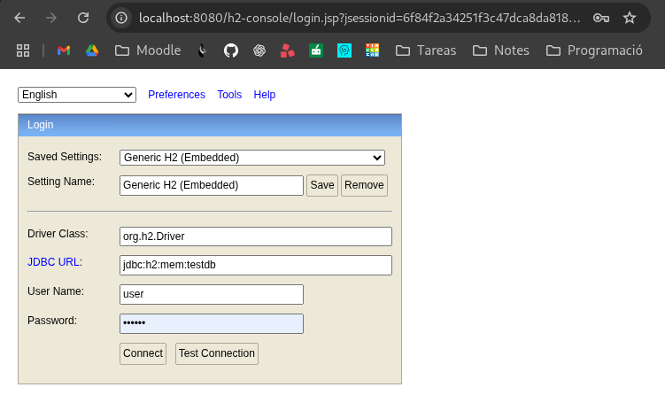
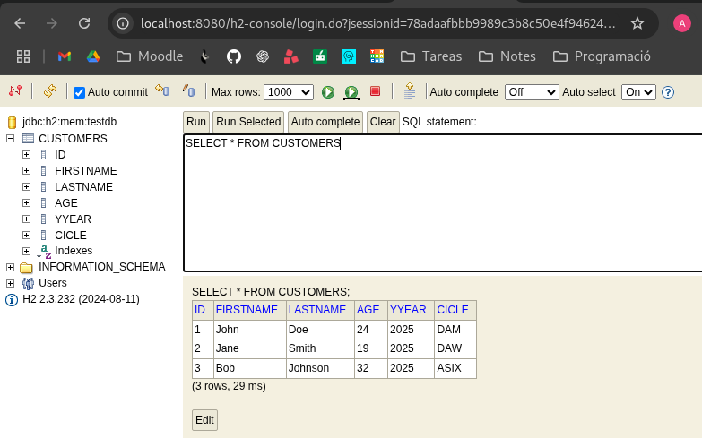
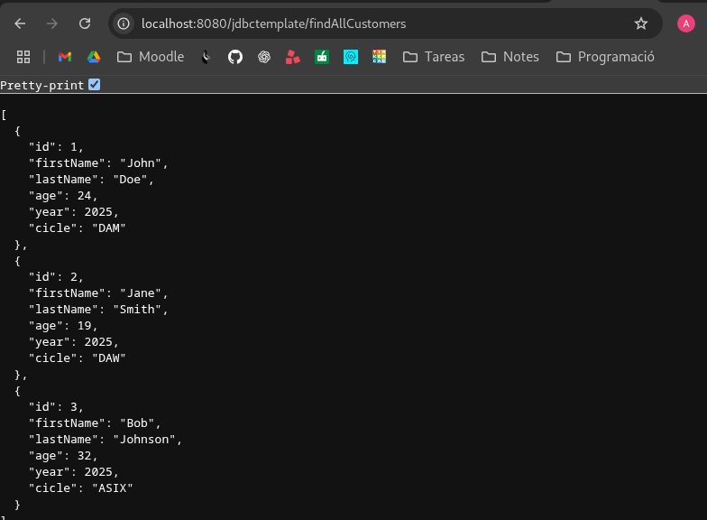
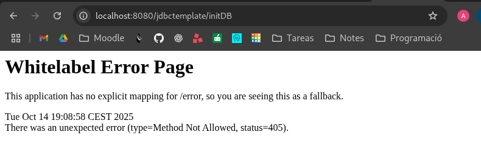

# ad_ra2_aav1

La següent captura mostra la pàgina per fer login que s'accedeix desde localhost:8080/h2-console tal i com s'ha indicat al fitxer application.properties.

Un cop es fà login s'accedeix a la consola de la base de dades on he executat les comandes de crear la taula i inserir les dades manualment. Tot seguit es pot veure amb un SELECT * la taula creada amb 3 clients.

De la mateixa forma es poden veure els clients en format json a l'endpoint findAllCustomers del controlador que crida la funció findAll() del repositori.
Això es pot veure un cop creada la taula i inserides les dades a través de la consola h2.

Finalment, l'endpoint initDB que hauria de ser el que crea la base de dades i insereix les dades no es pot executar desde un navegador i s'hauria de fer desde per exemple Postman més endevant.

